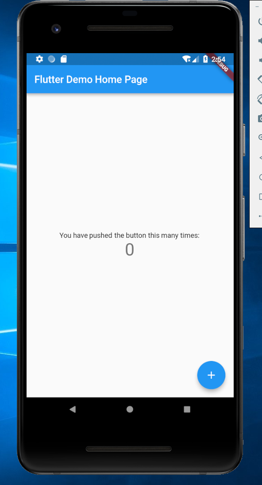
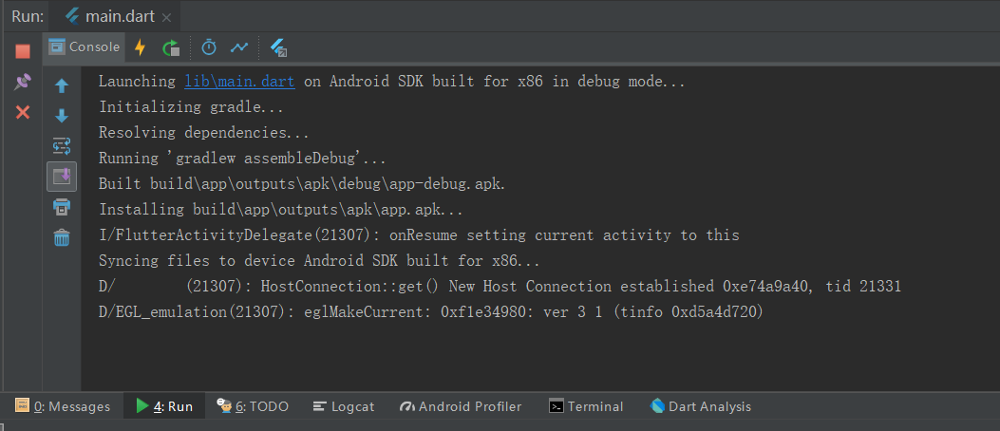
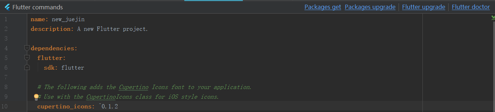
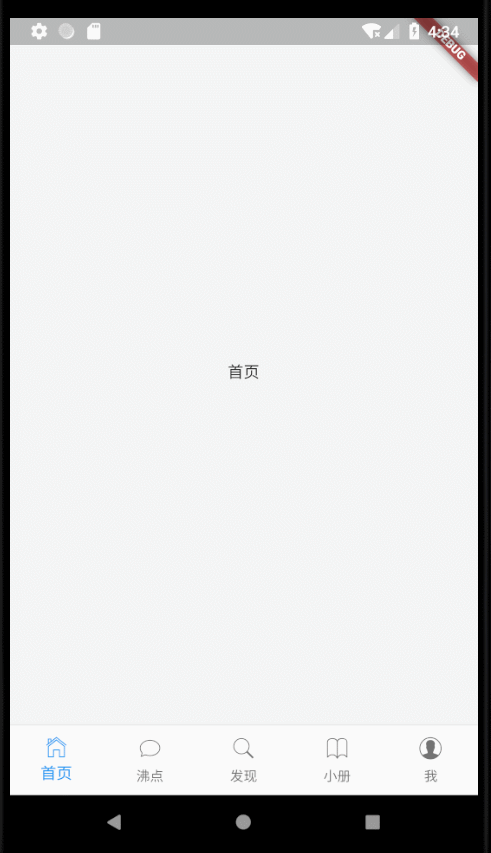

# Flutter入门——山寨掘金（一）

### 写在前面
之前发了一篇文章——《用Flutter山寨一下掘金》，由于是自己学习Flutter时的练手项目，文中完全没有写过程，只将源码上传到了GitHub。现受掘金邀请，将文章写成入门教程，让对Flutter感兴趣的小伙伴都能看懂。

我把项目分成四个小节，按照改版后的掘金app重新写成了教程，供大家一起学习和交流。由于是入门教程，文中内容不会很深入，对于已经学习过Flutter一段时间的小伙伴，略过就好啦。我是前端开发一枚，也是初学Flutter，文中出现的错误，还请小伙伴们指出。

现在开始今天的学习。

#### 一. 首先新建项目，名称随意

生成的项目结构如下：


在此项目中，我们的业务代码都在 ``` lib ``` 下，包配置都在 ```pubspec.yaml``` 中。


点击右上角的模拟器按钮，选择已经配置好的模拟器，再点击旁边的绿色三角形，稍等片刻，当你在模拟器中看到下面的效果，恭喜，项目跑起来了：



##### Tip：

1. Flutter的安装和配置小伙伴们就自己完成吧，我使用的是Windows和intellij，参照的是ios版掘金app，小伙伴们后面看到模拟器不要笑啊，因为我买不起苹果啊，哈哈！
2. 上图中的 ```screenshots``` 和 ```articles``` 文件夹是我写文章用的，小伙伴们不用看。

#### 二、改造根组件

打开 ```lib``` 中的 ```main.dart``` 文件，会看到已经有一些代码，有注释，小伙伴们可以阅读一下（截图有点长，贴代码有点多，小伙伴们就自己看了哈）。删掉原有的代码，我们开始写自己的代码：

```dart
import 'package:flutter/material.dart';

void main() => runApp(new MyApp());

class MyApp extends StatelessWidget {
  @override
  Widget build(BuildContext context) {
    return new MaterialApp(
      theme: new ThemeData(
          highlightColor: Colors.transparent,   //将点击高亮色设为透明
          splashColor: Colors.transparent,    //将喷溅颜色设为透明
          bottomAppBarColor: new Color.fromRGBO(244, 245, 245, 1.0),    //设置底部导航的背景色
          scaffoldBackgroundColor: new Color.fromRGBO(244, 245, 245, 1.0),    //设置页面背景颜色
          primaryIconTheme: new IconThemeData(color: Colors.blue),    //主要icon样式，如头部返回icon按钮
          indicatorColor: Colors.blue,    //设置tab指示器颜色
          iconTheme: new IconThemeData(size: 18.0),   //设置icon样式
          primaryTextTheme: new TextTheme(    //设置文本样式
              title: new TextStyle(color: Colors.black, fontSize: 16.0))),
    );
  }
}
```

小伙伴们会发现和之前的代码有些不一样，不用惊讶，写法可以有很多种，以后就明白了。你要是现在点底部的 ```Hot Reload``` 或者 ```Hot Restart``` 会发现啥也没有，当然啦，我们啥都还没写呢：



##### Tip:

1. 头部的 ```import``` 是引入我们需要用的包等东西，这里引入了 ```material.dart``` ，这是一个包含了大量 ```material``` 风格的组件的包。
2. Flutter中的 ```Widget``` （组件）有两类， ```StatelessWidget```是无状态的， ```StatefulWidget``` 是有状态的，当你的页面会随着状态的改变发生变化时使用。两者中必有 ```build``` 方法，用于创建内容。
3. ```MaterialApp``` 是应用的根组件，这是实现了 ```material``` 风格的```WidgetsApp``` ，后面所有的页面、组件都会在其中。
4. ```theme``` 中是对组件做一些全局配置。

>小伙伴们一定要多看文档哈，虽然文档很多，但要是你不看，你可能会懵逼的，尤其是做前端开发的同志，dart是新语言，语法这些是必须要学习的，我不可能在文中逐行解释哈，切记！

#### 二、实现app界面结构

在 ```lib``` 文件夹下新建 ```pages``` 文件夹，用于存放我们的页面。然后再  ```pages``` 文件夹下新建 ```index.dart``` 、 ```home.dart``` 、 ```discovery.dart``` 、 ```hot.dart``` 、 ```book.dart``` 、 ```mine.dart``` ，对应底部的每个tab，这是我们项目中主要会用到的文件了。


在 ```index.dart``` 文件中写入如下内容：

```dart
import 'package:flutter/cupertino.dart';
import 'package:flutter/material.dart';
import 'home.dart';
import 'hot.dart';
import 'discovery.dart';
import 'book.dart';
import 'mine.dart';

class IndexPage extends StatefulWidget {
  @override
  createState() => new IndexPageState();
}

class IndexPageState extends State<IndexPage> {
//  定义底部导航列表
  final List<BottomNavigationBarItem> bottomTabs = [
    new BottomNavigationBarItem(
      icon: new Icon(CupertinoIcons.home),
      title: new Text('首页'),
    ),
    new BottomNavigationBarItem(
        icon: new Icon(CupertinoIcons.conversation_bubble),
        title: new Text('沸点')),
    new BottomNavigationBarItem(
        icon: new Icon(CupertinoIcons.search), title: new Text('发现')),
    new BottomNavigationBarItem(
        icon: new Icon(CupertinoIcons.book), title: new Text('小册')),
    new BottomNavigationBarItem(
        icon: new Icon(CupertinoIcons.profile_circled), title: new Text('我'))
  ];
  final List<Widget> tabBodies = [
    new HomePage(),
    new HotPage(),
    new DiscoveryPage(),
    new BookPage(),
    new MinePage()
  ];
  int currentIndex = 0; //当前索引
  Widget currentPage; //当前页面

  @override
  void initState() {
    super.initState();
    currentPage = tabBodies[currentIndex];
  }

  @override
  Widget build(BuildContext context) {
    // TODO: implement build
    return new Scaffold(
      bottomNavigationBar: new BottomNavigationBar(
          type: BottomNavigationBarType.fixed,
          currentIndex: currentIndex,
          items: bottomTabs,
          onTap: (index) {
            setState(() {
              currentIndex = index;
              currentPage = tabBodies[currentIndex];
            });
          }),
      body: currentPage,
    );
  }
}

```

上面的代码创建了一个即底部有tab按钮的基本页面结构，用于切换不同页面。通过点击事件改变当前索引，来显示相应的页面。```bottomTabs``` 可以封装一下，就留给小伙伴们自己弄了哈，当是练习。

顶部我们引入了一个 ```Cupertino.dart```，这是ios风格的组件，我们还用到了ios的图标，引入前我们需要到 ```pubspec.yaml```中配置一下，然后点击 ```Packages get```:



##### Tip:

2. 因为我们的页面内容是会切换的，换句话说，状态会发生改变，所以这里使用 ```StatefulWidget```。
3. ```final``` 关键字用于申明一个常量，```List<BottomNavigationBarItem>``` 中的 ```List``` 用于申明一个数组，相当于js中的 ```Array```，后面的 ```BottomNavigationBarItem``` 指的是元素的类型。
4. ```Scaffold``` 可能是用得最多的组件了，它对页面实现了一些结构划分，其余的属性部分，小伙伴们就自己看文档了哈，不难，记住就行。

>再次强调，小伙伴们一定要多看文档，不然你真的会懵逼的！

接着我们在其余文件中写入下面的代码，只修改页面名字：

```dart
import 'package:flutter/material.dart';
import 'package:flutter/cupertino.dart';

class HotPage extends StatefulWidget {
  @override
  HotPageState createState() => new HotPageState();
}

class HotPageState extends State<HotPage> {
  @override
  Widget build(BuildContext context) {
    // TODO: implement build
    return new Center(child: new Text('沸点'),);
  }
}
```

保存一下，如果你在模拟器上看到下面的内容，就成功了：



tabs也可以用ios风格的```CupertinoTabBar```实现，此组件的表现和ios原生的一模一样，留给小伙伴们当练习哈。

#### 三、首页实现

现在我们来实现首页，先在 ```lib``` 文件夹下新建一个 ```config``` 文件夹，并在其中创建 ```httpHeaders.dart``` 文件，写入下列代码：

```dart
const httpHeaders = {
  'Accept': '*/*',
  'Accept-Encoding': 'gzip, deflate, br',
  'Accept-Language': 'zh-CN,zh;q=0.9',
  'Connection': 'keep-alive',
  'Host': 'gold-tag-ms.juejin.im',
  'Origin': 'https://juejin.im',
  'Referer': 'https://juejin.im/timeline',
  'User-Agent':
      'Mozilla/5.0 (iPhone; CPU iPhone OS 11_0 like Mac OS X) AppleWebKit/604.1.38 (KHTML, like Gecko) Version/11.0 Mobile/15A372 Safari/604.1',
  'X-Juejin-Client': '1532136021731',
  'X-Juejin-Src': 'web',
  'X-Juejin-Token':
      'eyJhY2Nlc3NfdG9rZW4iOiJWUmJ2dDR1RFRzY1JUZXFPIiwicmVmcmVzaF90b2tlbiI6IjBqdXhYSzA3dW9mSTJWUEEiLCJ0b2tlbl90eXBlIjoibWFjIiwiZXhwaXJlX2luIjoyNTkyMDAwfQ==',
  'X-Juejin-Uid': '59120a711b69e6006865dd7b'
};
```
这是掘金的请求头信息，后面会用到，先定义在这里，需要注意的是其中的 ```X-Juejin-Client``` 会变化，如果小伙伴们在看文章的时候发现值变了，改一下就行（好像不改也还是能用）。

打开 ```home.dart``` ，在顶部写入下列代码：

```dart
import 'package:flutter/material.dart';
import 'package:flutter/cupertino.dart';
import 'dart:convert';
import 'dart:async';
import 'package:http/http.dart' as http;
import '../config/httpHeaders.dart';

```

我们新引入了三个包，用来做网络请求。```dart:convert```用来做数据转换，```dart:async``` 做异步，```package:http/http.dart``` 做请求。接着：

```dart
/*接着写*/

class HomePage extends StatefulWidget {
  @override
  HomePageState createState() => new HomePageState();
}

class HomePageState extends State<HomePage> {
//  获取分类
  Future getCategories() async {
    final response = await http.get(
        'https://gold-tag-ms.juejin.im/v1/categories',
        headers: httpHeaders);
    if (response.statusCode == 200) {
      return json.decode(response.body);
    } else {
      throw Exception('Failed to load categories');
    }
  }

  @override
  Widget build(BuildContext context) {
    // TODO: implement build
    return FutureBuilder(
      future: getCategories(),
      builder: (context, snapshot) {
        if (snapshot.hasData) {
          var tabList = snapshot.data['d']['categoryList'];
          return new CreatePage(
            tabList: tabList,
          );
        } else if (snapshot.hasError) {
          return Text("error1>>>>>>>>>>>>>>>:${snapshot.error}");
        }
        return new Container(
          color: new Color.fromRGBO(244, 245, 245, 1.0),
        );
      },
    );
  }
}
```

这部分我们先获取获取掘金顶部的分类列表，```Future``` 类似于 ```Promise``` ，用来做异步请求， ```FutureBuilder``` 函数用来在请求返回后构建页面，返回的状态、数据等信息都在 ```snapshot``` 中（前端的同志们看到 ```async``` 和 ```await``` 是不是很眼熟？）。这里我们把构建页面的代码提取出来，不然嵌套太多让人崩溃，并把获取的tabs传下去。我这里用的 ```FutureBuilder```，小伙伴们也可以用文档中的写法，看上去还会更简洁，不过既然是学习嘛，写写也无妨。

```dart
/*接着写*/
//创建页面
class CreatePage extends StatefulWidget {
  final List tabList;

  @override
  CreatePage({Key key, this.tabList}) : super(key: key);

  CreatePageState createState() => new CreatePageState();
}

class CreatePageState extends State<CreatePage>
    with SingleTickerProviderStateMixin {
  @override
  Widget build(BuildContext context) {
    //TODO: implement build
    return new DefaultTabController(
        length: widget.tabList.length,
        child: new Scaffold(
          appBar: new AppBar(
            backgroundColor: new Color.fromRGBO(244, 245, 245, 1.0),
            automaticallyImplyLeading: false,
            titleSpacing: 0.0,
            title: new TabBar(
                indicatorSize: TabBarIndicatorSize.label,
                isScrollable: true,
                labelColor: Colors.blue,
                unselectedLabelColor: Colors.grey,
                tabs: widget.tabList.map((tab) {
                  return new Tab(
                    text: tab['name'],
                  );
                }).toList()),
            actions: <Widget>[
              new IconButton(
                  icon: new Icon(
                    Icons.add,
                    color: Colors.blue,
                  ),
                  onPressed: () {
                    Navigator.pushNamed(context, '/shareArticle');
                  })
            ],
          ),
          body: new TabBarView(
              children: widget.tabList.map((cate) {
                return ArticleLists(
                  categories: cate,
                );
              }).toList()),
        ));
  }
}
```

这部分用于创建tab选项和tab页面，```DefaultTabController``` 是创建 ```tabBarView``` 的一个简单组件，以后小伙伴们可以自己实现个性化的 ```tabBarView``` ，```action``` 里我已经把路由写进去了，等我们把页面写完，再去实现路由。我们把构建文章列表的代码也提出来，当每点击一个tab，就把对应的tab信息传入，查询文章会需要tab项中的 ```id```。

```dart
/*接着写*/
class ArticleLists extends StatefulWidget {
  final Map categories;

  @override
  ArticleLists({Key key, this.categories}) : super(key: key);

  ArticleListsState createState() => new ArticleListsState();
}

class ArticleListsState extends State<ArticleLists> {
  List articleList;

  Future getArticles({int limit = 20, String category}) async {
    final String url =
        'https://timeline-merger-ms.juejin.im/v1/get_entry_by_rank?src=${httpHeaders['X-Juejin-Src']}&uid=${httpHeaders['X-Juejin-Uid']}&device_id=${httpHeaders['X-Juejin-Client']}&token=${httpHeaders['X-Juejin-Token']}&limit=$limit&category=$category';
    final response = await http.get(Uri.encodeFull(url));
    if (response.statusCode == 200) {
      return json.decode(response.body);
    } else {
      throw Exception('Failed to load post');
    }
  }

  @override
  Widget build(BuildContext context) {
    // TODO: implement build
    return new FutureBuilder(
        future: getArticles(category: widget.categories['id']),
        builder: (context, snapshot) {
          if (snapshot.hasData) {
            articleList = snapshot.data['d']['entrylist'];
            return new ListView.builder(
                itemCount: articleList.length,
                itemBuilder: (context, index) {
                  var item = articleList[index];
                  return createItem(item);
                });
          } else if (snapshot.hasError) {
            return new Center(
              child: new Text("error2>>>>>>>>>>>>>>>:${snapshot.error}"),
            );
          }
          return new CupertinoActivityIndicator();
        });
  }
}
```
我们把单个文章的构建代码也提出来，让代码看着舒服点。

```dart
class ArticleListsState extends State<ArticleLists> {
/*接着写*/

//单个文章
  Widget createItem(articleInfo) {
    var objectId = articleInfo['originalUrl']
        .substring(articleInfo['originalUrl'].lastIndexOf('/') + 1);
    var tags = articleInfo['tags'];
    return new Container(
      margin: new EdgeInsets.only(bottom: 10.0),
      padding: new EdgeInsets.only(top: 10.0, bottom: 10.0),
      child: new FlatButton(
        padding: new EdgeInsets.all(0.0),
        onPressed: () {
          Navigator.push(
              context,
              new CupertinoPageRoute(
                  builder: (context) => ArticleDetail(
                        objectId: objectId,
                        articleInfo: articleInfo,
                      )));
        },
        child: new Column(
          children: <Widget>[
            new Row(
              mainAxisAlignment: MainAxisAlignment.spaceBetween,
              children: <Widget>[
                new FlatButton(
                    onPressed: null,
                    child: new Row(
                      children: <Widget>[
                        new CircleAvatar(
                          backgroundImage: new NetworkImage(
                              articleInfo['user']['avatarLarge']),
                        ),
                        new Padding(padding: new EdgeInsets.only(right: 5.0)),
                        new Text(
                          articleInfo['user']['username'],
                          style: new TextStyle(color: Colors.black),
                        )
                      ],
                    )),
                tags.isNotEmpty
                    ? (tags.length >= 2
                        ? new Row(
                            mainAxisAlignment: MainAxisAlignment.end,
                            children: <Widget>[
                              new FlatButton(
                                  onPressed: null,
                                  child: new Text(
                                    tags[0]['title'].toString(),
                                    style: new TextStyle(fontSize: 14.0),
                                  )),
                              new Text('/'),
                              new FlatButton(
                                  onPressed: null,
                                  child: new Text(
                                    tags[1]['title'].toString(),
                                    style: new TextStyle(fontSize: 14.0),
                                  ))
                            ],
                          )
                        : new FlatButton(
                            onPressed: null,
                            child: new Text(
                              tags[0]['title'].toString(),
                              style: new TextStyle(fontSize: 14.0),
                            )))
                    : new Container(
                        width: 0.0,
                        height: 0.0,
                      )
              ],
            ),
            new ListTile(
              title: new Text(articleInfo['title']),
              subtitle: new Text(
                articleInfo['summaryInfo'],
                maxLines: 2,
              ),
            ),
            new Row(
              children: <Widget>[
                new FlatButton(
                    onPressed: null,
                    child: new Row(
                      children: <Widget>[
                        new Icon(Icons.favorite),
                        new Padding(padding: new EdgeInsets.only(right: 5.0)),
                        new Text(articleInfo['collectionCount'].toString())
                      ],
                    )),
                new FlatButton(
                    onPressed: null,
                    child: new Row(
                      children: <Widget>[
                        new Icon(Icons.message),
                        new Padding(padding: new EdgeInsets.only(right: 5.0)),
                        new Text(articleInfo['commentsCount'].toString())
                      ],
                    ))
              ],
            )
          ],
        ),
      ),
      color: Colors.white,
    );
  }
}
```

每个文章中的交互我这里就不做那么全了，不然篇幅太大，样式小伙伴们也自己调吧，这个花时间。


在单个文章的按钮里我已经写好了跳转函数，就是 ```onPressed``` 中的代码，里面用到的 ```CupertinoPageRoute``` 主要是ios风格的滑动动画，我们来实现详情页。

#### 四、实现文章详情页

在 ```pages``` 文件夹下新建 ```articleDetail.dart``` 文件，flutter目前还不支持渲染 ```html``` ，因此我们这里需要引入一个插件 ```flutter_html_view```，这个插件支持的标签也不是很多，但目前差不多够用了，为作者点个赞。打开 ```pubspec.yaml``` 文件，在 ```dependencies``` 下写入依赖：

```dart
dependencies:
  flutter:
    sdk: flutter

  # The following adds the Cupertino Icons font to your application.
  # Use with the CupertinoIcons class for iOS style icons.
  cupertino_icons: ^0.1.2
  flutter_html_view: "^0.5.1"
```

然后在 ```articleDetail.dart``` 顶部引入：

```dart
import 'package:flutter/material.dart';
import 'package:flutter/cupertino.dart';
import 'dart:convert';
import 'dart:async';
import 'package:http/http.dart' as http;
import '../config/httpHeaders.dart';
import 'package:flutter_html_view/flutter_html_view.dart';
```
接着就是写页面了：

```dart
class ArticleDetail extends StatefulWidget {
  final String objectId;
  final Map articleInfo;

  @override
  ArticleDetail({Key key, this.objectId, this.articleInfo}) : super(key: key);

  @override
  ArticleDetailState createState() => new ArticleDetailState();
}

class ArticleDetailState extends State<ArticleDetail> {
  Future getContent() async {
    final String url =
        'https://post-storage-api-ms.juejin.im/v1/getDetailData?uid=${httpHeaders['X-Juejin-Src']}&device_id=${httpHeaders['X-Juejin-Client']}&token=${httpHeaders['X-Juejin-Token']}&src=${httpHeaders['X-Juejin-Src']}&type=entryView&postId=${widget
        .objectId}';
    final response = await http.get(Uri.encodeFull(url));
    if (response.statusCode == 200) {
      return json.decode(response.body)['d'];
    } else {
      throw Exception('Failed to load content');
    }
  }

  @override
  Widget build(BuildContext context) {
    // TODO: implement build
    var articleInfo = widget.articleInfo;
    return new FutureBuilder(
        future: getContent(),
        builder: (context, snapshot) {
          if (snapshot.hasData) {
            var content = snapshot.data['content'];
            return new Scaffold(
                appBar: new AppBar(
                  backgroundColor: new Color.fromRGBO(244, 245, 245, 1.0),
                  leading: new IconButton(
                      padding: new EdgeInsets.all(0.0),
                      icon: new Icon(
                        Icons.chevron_left,
                      ),
                      onPressed: () {
                        Navigator.pop(context);
                      }),
                  title: new Row(
                    children: <Widget>[
                      new CircleAvatar(
                        backgroundImage: new NetworkImage(
                            articleInfo['user']['avatarLarge']),
                      ),
                      new Padding(padding: new EdgeInsets.only(right: 5.0)),
                      new Text(articleInfo['user']['username'])
                    ],
                  ),
                  actions: <Widget>[
                    new IconButton(
                        icon: new Icon(
                          Icons.file_upload,
                          color: Colors.blue,
                        ),
                        onPressed: null)
                  ],
                ),
                bottomNavigationBar: new Container(
                  height: 50.0,
                  padding: new EdgeInsets.only(left: 10.0, right: 10.0),
                  decoration: new BoxDecoration(
                      color: new Color.fromRGBO(244, 245, 245, 1.0),
                      border: new Border(
                          top: new BorderSide(width: 0.2, color: Colors.grey))),
                  child: new Row(
                    mainAxisAlignment: MainAxisAlignment.spaceBetween,
                    crossAxisAlignment: CrossAxisAlignment.center,
                    children: <Widget>[
                      new Row(
                        children: <Widget>[
                          new Icon(
                            Icons.favorite_border,
                            color: Colors.green,
                            size: 24.0,
                          ),
                          new Padding(
                              padding: new EdgeInsets.only(right: 20.0)),
                          new Icon(
                            Icons.message,
                            color: Colors.grey,
                            size: 24.0,
                          ),
                          new Padding(
                              padding: new EdgeInsets.only(right: 20.0)),
                          new Icon(
                            Icons.playlist_add,
                            color: Colors.grey,
                            size: 24.0,
                          )
                        ],
                      ),
                      new Text(
                          '喜欢 ${articleInfo['collectionCount']} · 评论 ${articleInfo['commentsCount']}')
                    ],
                  ),
                ),
               );
          } else if (snapshot.hasError) {
            return new Container(
              color: Colors.white,
              child: new Text("error2>>>>>>>>>>>>>>>:${snapshot.error}"),
            );
          }
          return new Container(
            color: new Color.fromRGBO(244, 245, 245, 1.0),
            child: new CupertinoActivityIndicator(),
          );
        });
  }
}
```

将```html``` 写入页面的就是下面这段代码：

```dart
 body: new ListView(
                  children: <Widget>[
                    new Container(
                        color: Colors.white,
                        child: new HtmlView(
                          data: content,
                        ))
                  ],
                )
```

细心的小伙伴会发现，```bottomNavigationBar``` 中传入的是一个有高度的 ```Container``` ，这个很重要，flutter中的组件其实是很灵活的，不要被官网提供的组件限制了，只要满足条件（比如```bottomNavigationBar```  必须传入 ```PreferredSizeWidget```），各种各样的自定义组件都可以用。

点赞、评论啥的我们先不做，用过掘金app的小伙伴都知道，这些功能是需要登录后才能用的，所以我们放到后面来实现。


### 结尾叨叨

自己是初学flutter，最近也很忙，文中的错误和不足，还请大家原谅，欢迎指出，一起学习，今天就到这里了。