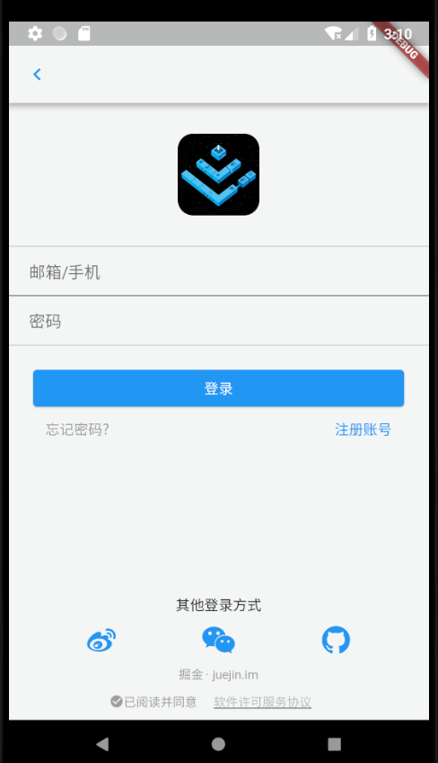
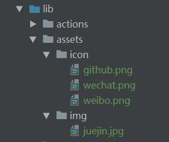
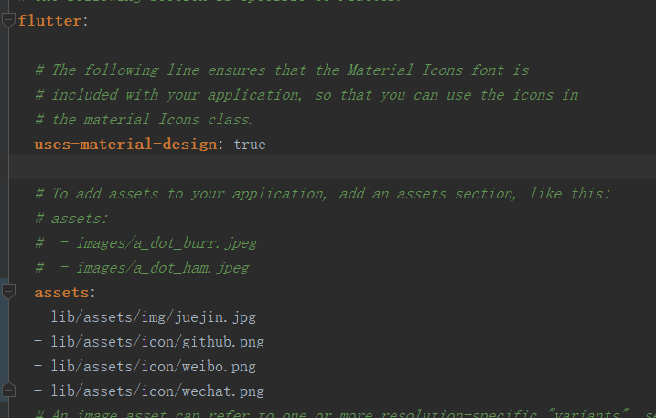
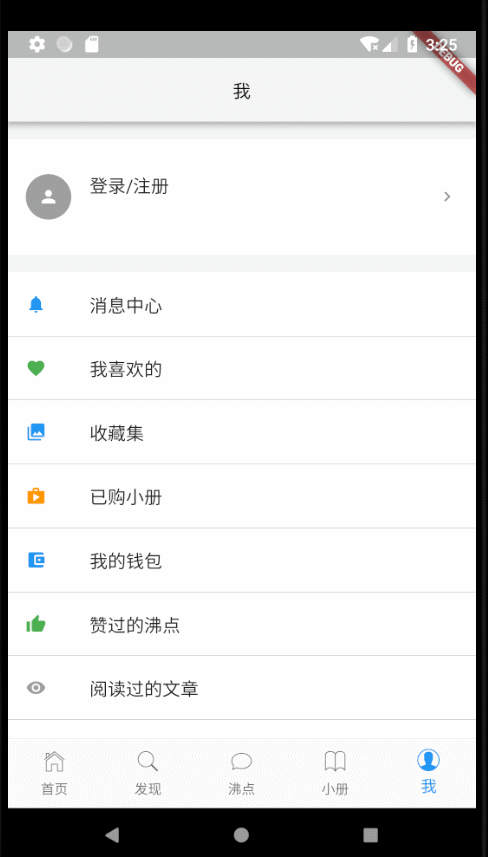
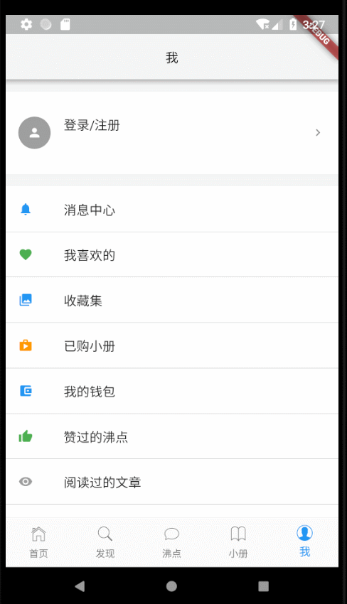

# Flutter入门——山寨掘金（三）

### 写在前面

这段时间太忙了，原计划两天更新一篇的计划也给耽误了，而且发现，计划四篇的文章三篇就够了，所以今天就来完成整个山寨项目。

在前两篇文章中，我们已经完成了底部tab中的首页和发现页，以及对应的一些页面，今天我们先不做沸点页和小册页，先做我的这一页。

#### 一. 引入Redux

写过 ```react``` 的小伙伴对 ```redux``` 一定不陌生，我们这里引入 ``` flutter_redux``` 这个插件来管理登录状态，它是国外的牛人写的，小伙伴们之后自己了解吧，这里为作者点个赞。

打开 ```pubspec.yaml``` 写入依赖，并 ```get``` 一下：

```dart
dependencies:
  flutter_redux: ^0.5.2

```

然后打开 ```main.dart``` ，引入 ```redux``` ：

```dart
import 'package:flutter_redux/flutter_redux.dart';
import 'package:redux/redux.dart';
```
接着，我们在 ```lib``` 下新建 ```reducers``` 文件夹，并在其中新建 ```reducers.dart``` ，写入下列代码：
```dart
Map getUserInfo(Map userInfo, dynamic action) {
  if (action.type == 'SETUSERINFO') {
    userInfo = action.userInfo;
  } else if (action.type == 'GETUSERINFO') {}
  print(action.type);
  return userInfo;
}
```
接着在 ```lib``` 下新建 ```actions``` 文件夹，并在其中新建 ```actions.dart``` ,写入下列代码：
```dart
class UserInfo {
  String type;
  final Map userInfo;

  UserInfo(this.type,this.userInfo);
}

```
小伙伴们一看就知道就是做获取用户信息及修改用户信息的，就不多做解释。

回到 ```main.dart``` ，引入 ```actions``` 和 ```reducers``` 并改造之前的代码：

```dart
import 'actions/actions.dart';
import 'reducers/reducers.dart';

void main() {
  final userInfo = new Store<Map>(getUserInfo, initialState: {});

  runApp(new MyApp(
    store: userInfo,
  ));
}

class MyApp extends StatelessWidget {
  final Store<Map> store;

  MyApp({Key key, this.store}) : super(key: key);

  @override
  Widget build(BuildContext context) {
    return new StoreProvider(
        store: store,
        child: new MaterialApp(
          home: new IndexPage(),
          theme: new ThemeData(
              highlightColor: Colors.transparent,
              //将点击高亮色设为透明
              splashColor: Colors.transparent,
              //将喷溅颜色设为透明
              bottomAppBarColor: new Color.fromRGBO(244, 245, 245, 1.0),
              //设置底部导航的背景色
              scaffoldBackgroundColor: new Color.fromRGBO(244, 245, 245, 1.0),
              //设置页面背景颜色
              primaryIconTheme: new IconThemeData(color: Colors.blue),
              //主要icon样式，如头部返回icon按钮
              indicatorColor: Colors.blue,
              //设置tab指示器颜色
              iconTheme: new IconThemeData(size: 18.0),
              //设置icon样式
              primaryTextTheme: new TextTheme(
                  //设置文本样式
                  title: new TextStyle(color: Colors.black, fontSize: 16.0))),
          routes: <String, WidgetBuilder>{
            '/search': (BuildContext context) => SearchPage(),
            '/activities': (BuildContext context) => ActivitiesPage(),
          },
        ));
  }
}

```

我们用 ```StoreProvider``` 将根组件 ```MaterialApp``` 包裹起来，因为其他页面都是在根组件下的，所以其他所有页面都能获取到 ```store``` 。到此我们就算是引入 ```redux``` 了。

#### 二. 实现登录页

我们这里做的是用户登录状态的管理，所以我们先实现登录页。

在 ```pages``` 下新建 ```signin.dart``` ，先引入所需要的东西：

```dart
import 'package:flutter/material.dart';
import 'package:flutter/cupertino.dart';
import 'dart:convert';
import 'package:http/http.dart' as http;
import 'package:flutter_redux/flutter_redux.dart';
import 'package:redux/redux.dart';
import '../actions/actions.dart';
import '../reducers/reducers.dart';
```

接着，我们先定义一下变量啥的，后面会用到：

```dart
/*接着写*/

class SignInPage extends StatefulWidget {
  @override
  SignInPageState createState() => new SignInPageState();
}

class SignInPageState extends State<SignInPage> {
  String account; //账号
  String password; //密码
  Map userInfo; //用户信息
  List signMethods = [ //其他登录方式
    'lib/assets/icon/weibo.png',
    'lib/assets/icon/wechat.png',
    'lib/assets/icon/github.png'
  ];
  RegExp phoneNumber = new RegExp(
      r"(0|86|17951)?(13[0-9]|15[0-35-9]|17[0678]|18[0-9]|14[57])[0-9]{8}"); //验证手机正则表达式
  final TextEditingController accountController = new TextEditingController();
  final TextEditingController passwordController = new TextEditingController();

  //显示提示信息
  void showAlert(String value) {
    showDialog(
        context: context,
        builder: (context) {
          return new AlertDialog(
            content: new Text(value),
          );
        });
  }
}

```
这里只需注意两个 ```controller``` ，因为我这里用的是 ```TextField``` ，所以需要它们俩来对输入框做一些控制。当然，小伙伴们也可以用 ```TextForm``` 。

```dart
class SignInPageState extends State<SignInPage> {
/*接着写*/
  @override
  Widget build(BuildContext context) {
    // TODO: implement build
    return new Scaffold(
        appBar: new AppBar(
          backgroundColor: new Color.fromRGBO(244, 245, 245, 1.0),
          titleSpacing: 0.0,
          leading: new IconButton(
              icon: new Icon(Icons.chevron_left),
              onPressed: (() {
                Navigator.pop(context);
              })),
        ),
        body: new Container(
          child: new Column(
            crossAxisAlignment: CrossAxisAlignment.center,
            mainAxisAlignment: MainAxisAlignment.spaceBetween,
            children: <Widget>[
              new Container(
                child: new Column(
                  children: <Widget>[
                    new Container(
                        height: 80.0,
                        margin: new EdgeInsets.only(top: 30.0, bottom: 30.0),
                        child: new ClipRRect(
                          borderRadius: new BorderRadius.circular(15.0),
                          child: new Image.asset(
                            'lib/assets/img/juejin.jpg',
                          ),
                        )),
                    new Container(
                      decoration: new BoxDecoration(
                          border: new Border(
                              top: new BorderSide(
                                  width: 0.5, color: Colors.grey),
                              bottom: new BorderSide(
                                  width: 0.5, color: Colors.grey))),
                      margin: new EdgeInsets.only(bottom: 20.0),
                      child: new Column(
                        children: <Widget>[
                          new TextField(
                            decoration: new InputDecoration(
                                hintText: '邮箱/手机',
                                border: new UnderlineInputBorder(
                                    borderSide: new BorderSide(
                                        color: Colors.grey, width: 0.2)),
                                prefixIcon: new Padding(
                                    padding: new EdgeInsets.only(right: 20.0))),
                            controller: accountController,
                            onChanged: (String content) {
                              setState(() {
                                account = content;
                              });
                            },
                          ),
                          new TextField(
                            decoration: new InputDecoration(
                                border: InputBorder.none,
                                hintText: '密码',
                                prefixIcon: new Padding(
                                    padding: new EdgeInsets.only(right: 20.0))),
                            controller: passwordController,
                            onChanged: (String content) {
                              setState(() {
                                password = content;
                              });
                            },
                          ),
                        ],
                      ),
                    ),
                    new Container(
                        padding: new EdgeInsets.only(left: 20.0, right: 20.0),
                        child: new Column(
                          children: <Widget>[
                            new StoreConnector<Map, VoidCallback>(
                              converter: (store) {
                                return () => store.dispatch(
                                    UserInfo('SETUSERINFO', userInfo));
                              },
                              builder: (context, callback) {
                                return new Card(
                                  color: Colors.blue,
                                  child: new FlatButton(
                                      onPressed: () {
                                        if (account == null) {
                                          showAlert('请输入账号');
                                        } else if (password == null) {
                                          showAlert('请输入密码');
                                        } else if (phoneNumber
                                            .hasMatch(account)) {
                                          String url =
                                              "https://juejin.im/auth/type/phoneNumber";
                                          http.post(url, body: {
                                            "phoneNumber": account,
                                            "password": password
                                          }).then((response) {
                                            if (response.statusCode == 200) {
                                              userInfo =
                                                  json.decode(response.body);
                                              callback();
                                              Navigator.pop(context);
                                            }
                                          });
                                        } else {
                                          showAlert('请输入正确的手机号码');
                                        }
                                      },
                                      child: new Row(
                                        mainAxisAlignment:
                                            MainAxisAlignment.center,
                                        children: <Widget>[
                                          new Text(
                                            '登录',
                                            style: new TextStyle(
                                                color: Colors.white),
                                          )
                                        ],
                                      )),
                                );
                              },
                            ),
                            new Row(
                              mainAxisAlignment: MainAxisAlignment.spaceBetween,
                              children: <Widget>[
                                new FlatButton(
                                  onPressed: () {},
                                  child: new Text(
                                    '忘记密码?',
                                    style: new TextStyle(color: Colors.grey),
                                  ),
                                ),
                                new FlatButton(
                                    onPressed: () {},
                                    child: new Text(
                                      '注册账号',
                                      style: new TextStyle(color: Colors.blue),
                                    )),
                              ],
                            )
                          ],
                        )),
                  ],
                ),
              ),
              new Container(
                child: new Column(
                  children: <Widget>[
                    new Text('其他登录方式'),
                    new Row(
                        mainAxisAlignment: MainAxisAlignment.spaceEvenly,
                        children: signMethods.map((item) {
                          return new IconButton(
                              icon: new Image.asset(
                                item,
                                color: Colors.blue,
                              ),
                              onPressed: null);
                        }).toList()),
                    new Text(
                      '掘金 · juejin.im',
                      style: new TextStyle(
                        color: Colors.grey,
                        fontSize: 12.0,
                      ),
                    ),
                    new Row(
                      mainAxisAlignment: MainAxisAlignment.center,
                      children: <Widget>[
                        new Icon(
                          Icons.check_circle,
                          color: Colors.grey,
                          size: 14.0,
                        ),
                        new Text(
                          '已阅读并同意',
                          style:
                              new TextStyle(color: Colors.grey, fontSize: 12.0),
                        ),
                        new FlatButton(
                            onPressed: null,
                            child: new Text(
                              '软件许可服务协议',
                              style: new TextStyle(
                                  decoration: TextDecoration.underline,
                                  decorationColor: const Color(0xff000000),
                                  fontSize: 12.0),
                            ))
                      ],
                    )
                  ],
                ),
              )
            ],
          ),
        ));
  }
}

```

页面长这个样子：



这部分内容稍微有点复杂，嵌套也比较多，我说一下关键点。
首先是 ```Image.asset``` ，这个组件是用来从我们的项目中引入图片，但使用前需要写入依赖。在 ```lib``` 下新建一个文件夹用于存放图片：



然后到 ```pubspec.yaml``` 下写依赖：



这样才能使用。

其次是在需要和 ```store``` 通信的地方用 ```StoreConnector``` 将组件包裹起来，我们这里主要是下面这一段：

```dart
  new StoreConnector<Map, VoidCallback>(
                               converter: (store) {
                                 return () => store.dispatch(
                                     UserInfo('SETUSERINFO', userInfo));
                               },
                               builder: (context, callback) {
                                 return new Card(
                                   color: Colors.blue,
                                   child: new FlatButton(
                                       onPressed: () {
                                         if (account == null) {
                                           showAlert('请输入账号');
                                         } else if (password == null) {
                                           showAlert('请输入密码');
                                         } else if (phoneNumber
                                             .hasMatch(account)) {
                                           String url =
                                               "https://juejin.im/auth/type/phoneNumber";
                                           http.post(url, body: {
                                             "phoneNumber": account,
                                             "password": password
                                           }).then((response) {
                                             if (response.statusCode == 200) {
                                               userInfo =
                                                   json.decode(response.body);
                                               callback();
                                               Navigator.pop(context);
                                             }
                                           });
                                         } else {
                                           showAlert('请输入正确的手机号码');
                                         }
                                       },
                                       child: new Row(
                                         mainAxisAlignment:
                                             MainAxisAlignment.center,
                                         children: <Widget>[
                                           new Text(
                                             '登录',
                                             style: new TextStyle(
                                                 color: Colors.white),
                                           )
                                         ],
                                       )),
                                 );
                               },
                             ),
```

```converter``` 返回一个函数，内容就是对 ```store``` 进行的操作，我们这里是登录，需要把登录信息写入 ```store``` ，所以这里是 ```SETUSERINFO``` 。这个返回的函数会被 ```builder``` 作为第二个参数，我们在调用掘金接口并登录成功后调用此函数将登录信息写入 ```store``` 。我这里做的是登录成功后回到之前的页面。

我们回到 ```main.dart``` ，添加一下路由：

```dart
import 'pages/signin.dart';
/*略过*/
  routes: <String, WidgetBuilder>{
            '/search': (BuildContext context) => SearchPage(),
            '/activities': (BuildContext context) => ActivitiesPage(),
            '/signin': (BuildContext context) => SignInPage(),
          },
```
其实页面写完，登录功能也就可以用了，但是我们得有一个入口进入到登录页面，所以我们接下来实现我的页面。

#### 一. 实现我的页面

打开 ```mine.dart``` ，先引入需要的东西并定义一些变量：

```dart
import 'package:flutter/material.dart';
import 'package:flutter/cupertino.dart';
import 'package:flutter_redux/flutter_redux.dart';
import 'package:redux/redux.dart';
import '../actions/actions.dart';
import '../reducers/reducers.dart';

class MinePage extends StatefulWidget {
  @override
  MinePageState createState() => new MinePageState();
}

class MinePageState extends State<MinePage> {
  List infoList = [
    {
      'key': 'msgCenter',
      'content': {
        'title': '消息中心',
        'icon': Icons.notifications,
        'color': Colors.blue,
        'path': '/msgCenter'
      }
    },
    {
      'key': 'collectedEntriesCount',
      'content': {
        'title': '我喜欢的',
        'icon': Icons.favorite,
        'color': Colors.green,
        'path': '/like'
      }
    },
    {
      'key': 'collectionSetCount',
      'content': {
        'title': '收藏集',
        'icon': Icons.collections,
        'color': Colors.blue,
        'path': '/collections'
      }
    },
    {
      'key': 'postedEntriesCount',
      'content': {
        'title': '已购小册',
        'icon': Icons.shop,
        'color': Colors.orange,
        'path': '/myBooks'
      }
    },
    {
      'key': 'collectionSetCount',
      'content': {
        'title': '我的钱包',
        'icon': Icons.account_balance_wallet,
        'color': Colors.blue,
        'path': '/myWallet'
      }
    },
    {
      'key': 'likedPinCount',
      'content': {
        'title': '赞过的沸点',
        'icon': Icons.thumb_up,
        'color': Colors.green,
        'path': '/pined'
      }
    },
    {
      'key': 'viewedEntriesCount',
      'content': {
        'title': '阅读过的文章',
        'icon': Icons.remove_red_eye,
        'color': Colors.grey,
        'path': '/read'
      }
    },
    {
      'key': 'subscribedTagsCount',
      'content': {
        'title': '标签管理',
        'icon': Icons.picture_in_picture,
        'color': Colors.grey,
        'path': '/tags'
      }
    },
  ];
}

```

这里的 ```infoList``` 就是一些选项，提出来写是为了让整体代码看着舒服点。路由我也写在里面了，等之后有空再慢慢完善吧。接着：

```dart
class MinePageState extends State<MinePage> {
  @override
  Widget build(BuildContext context) {
    // TODO: implement build
    return new StoreConnector<Map, Map>(
        converter: (store) => store.state,
        builder: (context, info) {
          Map userInfo = info;
          if (userInfo.isNotEmpty) {
            infoList.map((item) {
              item['content']['count'] = userInfo['user'][item['key']];
            }).toList();
          }
          return new Scaffold(
            appBar: new AppBar(
              title: new Text('我'),
              centerTitle: true,
              backgroundColor: new Color.fromRGBO(244, 245, 245, 1.0),
            ),
            body: new ListView(
              children: <Widget>[
                new StoreConnector<Map, Map>(
                  converter: (store) => store.state,
                  builder: (context, info) {
                    if(info.isEmpty){}else{}
                    return new Container(
                      child: new ListTile(
                        leading: info.isEmpty?
                          new CircleAvatar(
                          child: new Icon(Icons.person, color: Colors.white),
                          backgroundColor: Colors.grey,
                        ):new CircleAvatar(backgroundImage: new NetworkImage(info['user']['avatarLarge']),),
                        title: info.isEmpty
                            ? new Text('登录/注册')
                            : new Text(info['user']['username']),
                        subtitle: info.isEmpty
                            ? new Container(
                                width: 0.0,
                                height: 0.0,
                              )
                            : new Text(
                                '${info['user']['jobTitle']} @ ${info['user']['company']}'),
                        enabled: true,
                        trailing: new Icon(Icons.keyboard_arrow_right),
                        onTap: () {
                          Navigator.pushNamed(context, '/signin');
                        },
                      ),
                      padding: new EdgeInsets.only(top: 15.0, bottom: 15.0),
                      margin: const EdgeInsets.only(top: 15.0, bottom: 15.0),
                      decoration: const BoxDecoration(
                          border: const Border(
                            top: const BorderSide(
                                width: 0.2,
                                color:
                                    const Color.fromRGBO(215, 217, 220, 1.0)),
                            bottom: const BorderSide(
                                width: 0.2,
                                color:
                                    const Color.fromRGBO(215, 217, 220, 1.0)),
                          ),
                          color: Colors.white),
                    );
                  },
                ),
                new Column(
                    children: infoList.map((item) {
                  Map itemInfo = item['content'];
                  return new Container(
                    decoration: new BoxDecoration(
                        color: Colors.white,
                        border: new Border(bottom: new BorderSide(width: 0.2))),
                    child: new ListTile(
                      leading: new Icon(
                        itemInfo['icon'],
                        color: itemInfo['color'],
                      ),
                      title: new Text(itemInfo['title']),
                      trailing: itemInfo['count'] == null
                          ? new Container(
                              width: 0.0,
                              height: 0.0,
                            )
                          : new Text(itemInfo['count'].toString()),
                      onTap: () {
                        Navigator.pushNamed(context, itemInfo['path']);
                      },
                    ),
                  );
                }).toList()),
                new Column(
                  children: <Widget>[
                    new Container(
                      margin: new EdgeInsets.only(top: 15.0),
                      decoration: new BoxDecoration(
                          color: Colors.white,
                          border: new Border(
                              top: new BorderSide(width: 0.2),
                              bottom: new BorderSide(width: 0.2))),
                      child: new ListTile(
                        leading: new Icon(Icons.insert_drive_file),
                        title: new Text('意见反馈'),
                      ),
                    ),
                    new Container(
                      margin: new EdgeInsets.only(bottom: 15.0),
                      decoration: new BoxDecoration(
                          color: Colors.white,
                          border:
                              new Border(bottom: new BorderSide(width: 0.2))),
                      child: new ListTile(
                        leading: new Icon(Icons.settings),
                        title: new Text('设置'),
                      ),
                    ),
                  ],
                ),
              ],
            ),
          );
        });
  }
}
```

这里也是一样，因为我们整个页面都会用到 ```store``` ，所以我们在最外层使用 ```StoreConnector``` ，代码中有很多三元表达式，这个是为了在是否有登陆信息两种状态下显示不同内容的，完成后的页面长这个样子：



为什么显示的是登录/注册呢？因为我们没登录啊，哈哈！放一张完成后的联动图：



小伙伴们可以看到，登录后会显示用户的一些信息，细心的小伙伴会发现输入账号密码的时候会提示超出了，我个人觉得这个应该是正常的吧，毕竟底部键盘弹起来肯定会遮挡部分页面。其他需要用到登录状态的地方也是一样的写法。

### 结尾叨叨

至此，此入门教程就完结了。由于文章篇幅，沸点和小册两个tab页面我就不贴了，相信如果是从第一篇文章看到现在的小伙伴都会写了。

总结一下我们学习的东西，主要涉及的知识点如下：

* 基础组件的使用
* 网络请求
* 路由配置及传参
* ```html``` 代码的渲染
* 使用 ```redux``` 做状态管理

总结完了感觉没多少东西，不过我也是初学者，水平有限，文中的不足及错误还请指出，一起学习、交流。之后的话项目我会不时更新，不过是在GitHub上以代码的形式了，喜欢的小伙伴可以关注一下。源码[点这里]()

